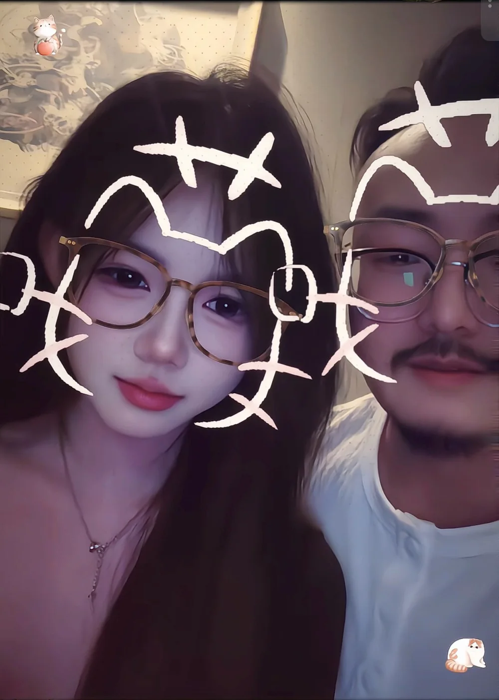
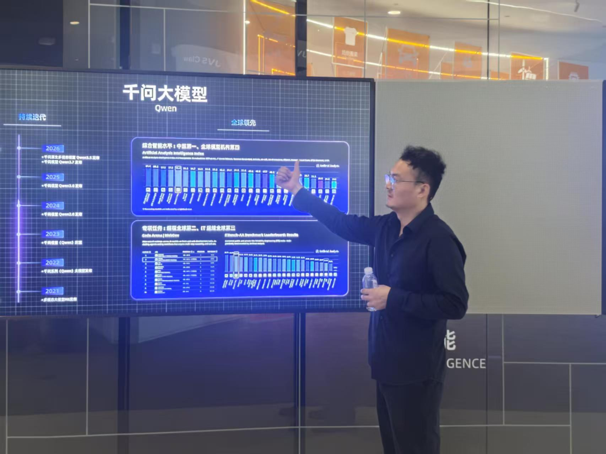

# Life Level-up Guide

[中文](https://byoungd.github.io/up/) | English

**By Han Xiankai, pen name “Li Pu”**

Subtitle: **Lifelong Learning Guide for the AI Era**. This living manuscript begins with English and continues into AI learning, real projects, entrepreneurship, recovery, and the work of returning your life to yourself one small act at a time.

  Living manuscript
  <a href="./book-downloads">Download Center</a>
  <a href="../downloads/life-level-up-guide-en.epub" download>Download English EPUB</a>
  <a href="../downloads/life-level-up-guide-zh.epub" download>下载中文 EPUB</a>
  <a href="../downloads/life-level-up-guide-en.pdf" download>Download English PDF</a>
  <a href="../downloads/life-level-up-guide-zh.pdf" download>下载中文 PDF</a>
  <a href="https://github.com/byoungd/up">Source and corrections</a>
  <a href="./templates/reader-field-note">Reader Field Note</a>
  <a href="https://creativecommons.org/licenses/by-nc/4.0/">Text CC BY-NC 4.0</a>

  

    START HERE
    <h2 id="quick-start-title">Choose one action before choosing how much to read</h2>
    
You do not need to read the whole book on your first visit. Choose one entry for today, complete a small action, and let the result point to the next page.

  

  

    <a class="quick-start-action" href="./threads/part-0/reader-guide"><strong>I do not know where to begin</strong>Use the Reader's Guide to choose by problem and see when to preserve evidence or return for a review.</a>
    <a class="quick-start-action" href="./templates/learning-state"><strong>I want to finish one thing today</strong>Use five minutes to write the real problem, current evidence, smallest action, and boundary before deciding whether you need the full record.</a>
    <a class="quick-start-action" href="./threads/part-1/0-cefr"><strong>I want to check one English skill</strong>Start from a real situation, preserve a first sample, and choose one line across listening, speaking, reading, or writing.</a>
  

AI is making answers cheaper than they have ever been. In seconds, we can receive an explanation, a block of code, a plan, even a confident-sounding piece of life advice. What remains scarce is more demanding: **knowing which questions deserve pursuit, deciding which evidence deserves trust, turning suggestions into real work, and taking responsibility for the final judgment.**

This is a lifelong-learning guide for ordinary people. It does not require you to begin as a genius, an expert, or a person with perfect discipline. It does not promise that a tool will change your fate. It offers a way to keep learning while the world accelerates: meet an unfamiliar problem, work with AI without surrendering judgment, finish something real, and carry the lesson into the next part of life.

The project began in 2017 as Li Pu's English Learning Guide. English was once the whole map; now it is one foundational road within it. The guide has widened into AI learning, project development, resource-layer entrepreneurship, life review, and recovery. This does not discard the past. It reveals the deeper question behind every kind of training: **when the world keeps changing, can I continue to learn, create, and participate in my own life?**

My name is Han Xiankai, also known online as Li Pu, and I serve as chairman of China Token Cloud Computing Co., Ltd. I test these methods in learning, software development, enterprise services, and ordinary life. My role and commercial relationships belong in public view. Claims about ability, products, and revenue must be earned by work, users, costs, and time.

The guide returns to one loop:

**find a problem → learn actively → work with AI → complete a real task → preserve evidence → review and transfer**

It also keeps three kinds of claim separate:

- **Research findings** include sources and state the reach of the evidence;
- **Personal experience** keeps its warmth without pretending to be a universal prescription;
- **Hypotheses** may enter the conversation, but the next experiment must test them.

  <section class="guide-path-group" aria-labelledby="guide-foundation">
01<h2 id="guide-foundation">Build the Foundation</h2>
Put the problem, language, and daily action on one map.

    <a class="guide-path" href="./templates/learning-state"><strong>Lifelong Learning System</strong>Begin with a real problem, a current baseline, and a minimum task so each cycle can continue, be retested, and transfer.</a>
    <a class="guide-path" href="./threads/part-1/0-cefr"><strong>Foundation: English</strong>Use English to reach global knowledge, technical documentation, and international AI tools, entering cross-cultural work through intelligibility rather than accent similarity.</a>
    <a class="guide-path" href="./threads/part-1/grammar"><strong>Grammar for Real Expression</strong>Begin with whether time, responsibility, condition, and certainty are understood, then retest one high-impact structure for fourteen days instead of memorising every rule first.</a>
    <a class="guide-path" href="./threads/part-1/6-writing"><strong>Writing and Asynchronous Delivery</strong>Preserve an unaided draft, fact sources, and revision reasons so email, reports, decisions, and handovers remain usable when the author is offline.</a>
  
</section>
  <section class="guide-path-group" aria-labelledby="guide-amplify">
02<h2 id="guide-amplify">Amplify Ability with Tools</h2>
Let AI accelerate questions and verification while people keep judgment, testing, and responsibility.

    <a class="guide-path" href="./threads/part-3/1-ai-learning"><strong>Learn Anything with AI</strong>Use AI for questions, research, and feedback while keeping fact-checking and final judgment in human hands.</a>
    <a class="guide-path" href="./threads/part-3/2-ai-development-and-resource-layer"><strong>AI Projects and Resource-layer Business</strong>Move from requirements, prototypes, code, and tests to model access, governance, enterprise delivery, and business validation.</a>
  
</section>
  <section class="guide-path-group" aria-labelledby="guide-life">
03<h2 id="guide-life">Enter Real Life</h2>
Carry learning into work, family, relationships, and the author's responsibilities.

    <a class="guide-path" href="./threads/part-1/8-job-search-english"><strong>Global Job Search and Remote Work</strong>Turn a job description into recruiter communication, project explanation, unfamiliar follow-ups, and asynchronous writing, then use real samples to locate the next gap.</a>
    <a class="guide-path" href="./threads/part-4/family-learning"><strong>Family and Middle-School Learning</strong>Let the learner help define the goal while adults protect environment, privacy, and safety; use fourteen days of evidence instead of surveillance or substituted work.</a>
    <a class="guide-path" href="./threads/part-2/care-and-carry-on"><strong>Care for the People Nearby</strong>Turn care into listening, practical help, and shared tasks. Accept support when both people are willing and able, keeping warmth and boundaries together.</a>
    <a class="guide-path" href="./threads/part-2/my-story"><strong>Life Review and Recovery</strong>Acknowledge failure and cost, then rebuild judgment, order, and action after disruption.</a>
    <a class="guide-path" href="./projects"><strong>Author Projects and Practice</strong>Make affiliations, purpose, update dates, and non-sponsorship visible so trust does not depend on guesswork.</a>
  
</section>
  <section class="guide-path-group guide-path-group-external" aria-labelledby="guide-external">
04<h2 id="guide-external">Third-party Resources</h2>
Optional external entry points, not safety, quality, or compliance endorsements by this book or its author.

    <a class="guide-path" href="https://biezou.com/" target="_blank" rel="noopener noreferrer"><strong>AI Relay Recommendation: biezou.com</strong>The official site describes a unified AI API gateway and admin dashboard. Treat it as an optional third-party entry point and verify terms, pricing, privacy, and availability before use.</a>
    <a class="guide-path" href="https://t.me/OpenHuge_ai" target="_blank" rel="noopener noreferrer"><strong>AI Resources on Telegram: OpenHuge_ai</strong>A third-party Telegram channel for discovering AI resources. Channel posts, outbound links, and availability can change; verify sources, privacy, copyright, and security risks before use.</a>
  
</section>

## Business, Discipline, and AI in Practice

Use the [Practice Map](practice.md) to choose a current problem and turn reading into a small experiment with inspectable results. These handbooks complement the six-part book and are included in its digital appendices.

| Current task | Practical handbook | Copyable tool |
| --- | --- | --- |
| A business idea without customer evidence | [From Problems to First Customers](threads/practice/customer-discovery.md) · [A Sustainable Small Business](threads/practice/sustainable-business.md) | [Startup Experiment](templates/startup-experiment.md) |
| Trouble starting or returning after a break | [Discipline and Consistency](threads/practice/discipline-and-consistency.md) | [Consistency Plan](templates/consistency-plan.md) |
| AI generates output but delivery is unreliable | [AI Workflows](threads/practice/ai-workflows.md) · [AI Evaluation and Reliability](threads/practice/ai-evaluation.md) | [AI Evaluation Record](templates/ai-evaluation.md) |

## Book Structure

For a complete read, begin with the [Reader's Guide: Put the Book Back into Life](threads/part-0/reader-guide.md), then continue to the [Prologue: Do Not Rush to Change Your Life](threads/part-0/prologue.md). The first explains how to choose an entry point, preserve evidence, and return after interruption; the second places those methods inside one person's life story. The book is not a straight climb. It is a loop we revisit:

When a term is unclear or you do not know which page to open next, use the [Glossary of Terms and Methods](reference/glossary.md) and follow “definition → evidence → next step” back to the main path. When you do not know which worksheet fits, start with the [Toolkit Overview](templates/toolkit.md) and choose one entry point by the problem in front of you.

| Part | Core question | Entry point |
| --- | --- | --- |
| Reader's Guide and Prologue | Where do I enter, and why begin again? | [Reader's Guide](threads/part-0/reader-guide.md) · [Do Not Rush to Change Your Life](threads/part-0/prologue.md) |
| Part I: Open Input | How do I build a bridge between English and the world, then carry ability into interviews and remote collaboration? | [Part Introduction](threads/part-1/open-input.md) · [CEFR Self-check](threads/part-1/0-cefr.md) · [Vocabulary](threads/part-1/2-vocabulary.md) · [Grammar](threads/part-1/grammar.md) · [Listening](threads/part-1/3-listening.md) · [Reading](threads/part-1/4-reading.md) · [Speaking](threads/part-1/5-speaking.md) · [Writing](threads/part-1/6-writing.md) · [Job-search English](threads/part-1/8-job-search-english.md) |
| Part II: Return to Life | How do ability, work, relationships, failure, choices, and recovery affect one another, and how can care and shared responsibility help us continue? | [Part Introduction](threads/part-2/return-to-life.md) · [My Story](threads/part-2/my-story.md) · [I Am Still Here: Coming Through Depression, Anxiety, and the Dark](threads/part-2/depression-anxiety-recovery.md) · [Narrative and Evidence](threads/part-2/narrative-and-evidence.md) · [Recovery, Decisions, and Relationships](threads/part-2/recovery.md) · [Care and Shared Responsibility](threads/part-2/care-and-carry-on.md) · [Entrepreneurship](threads/part-2/entrepreneurship.md) |
| Part III: Amplify Ability | How can I use AI without outsourcing judgment or attention? | [Part Introduction](threads/part-3/amplify-ability.md) · [AI Learning](threads/part-3/1-ai-learning.md) · [Attention, Artifacts, and Evidence](threads/part-3/3-attention-and-judgment.md) · [Project Practice](threads/part-3/2-ai-development-and-resource-layer.md) |
| Part IV: Practice and Recovery | How does learning return to the body, family, and daily life while protecting a young learner's agency when relevant? | [Part Introduction](threads/part-4/practice-and-recovery.md) · [First Week Practice](threads/part-4/week-1.md) · [Family Learning](threads/part-4/family-learning.md) · [Daily System](threads/part-4/daily-system.md) · [Rhythm](threads/part-4/rhythm-and-compounding.md) |
| Part V: Long-Term Action | How can ninety days, a real project, and the period afterward keep a method accountable? | [Part Introduction](threads/part-5/long-term-action.md) · [90-Day Action Plan](threads/part-5/90-day-plan.md) · [Book Case Study](threads/part-5/book-as-proof.md) · [After Ninety Days](threads/part-5/after-90-days.md) |
| Part VI: Be Your Own Lifelong Friend | How can I understand, recognise, care for, and improve myself while staying with myself through change? | [Understanding Yourself](threads/part-6/1-understanding-yourself.md) · [Knowing Yourself](threads/part-6/2-knowing-yourself.md) · [Being Kind to Yourself](threads/part-6/3-being-kind-to-yourself.md) · [Improving Yourself](threads/part-6/4-improving-yourself.md) · [Being Your Own Lifelong Friend](threads/part-6/5-being-your-own-lifelong-friend.md) |
| Afterword | Who do I want to become after leveling up? | [The Greatest Progress Is Finding Your True Self](threads/part-6/afterword.md) |

## Begin with One Small Act Today

Lifelong learning is not opening ten courses at once. It is completing one act today that leaves a trace:

1. Choose a real problem: a blocked step at work, a concept you need to understand, a person you want to help, or a small project left unfinished.
2. Record your baseline in [Learning State](templates/learning-state.md): what you know, what you cannot yet do, and what would count as complete. For decisions, attention, relationships, or recovery, use the [Life Practice Toolkit](templates/life-practice-toolkit.md); for a full cycle, copy the [90-Day Cycle Map](templates/90-day-cycle.md).
3. Ask AI to help shape a 25–45 minute task, then check the sources, make the choices, and finish the output yourself.
4. Preserve a page of notes, a piece of code, a recording, an email, or feedback rather than saving only the conversation.
5. A week later, use the [Weekly Review](templates/weekly-review.md) to examine completion, quality, retention, and transfer before choosing the next step.

You do not have to see the entire road. The first piece of evidence you preserve today becomes somewhere the next step can stand.

## AI Learning and Project Practice: From Answers to Delivery

When tools change too quickly to follow, start with [AI Trends and a Learning Roadmap](threads/part-3/6-ai-trends-and-learning-roadmap.md). Use an [AI Trend Experiment](templates/ai-trend-radar.md) to turn one new capability into a small comparison: check primary sources, retain a manual baseline, measure full costs, and decide whether to continue. The chapter separates observations from future hypotheses and provides practice in multimodal inputs, context, agents, evaluation, local models, and provenance.

[Learning Anything with AI](threads/part-3/1-ai-learning.md) does not begin with “Which model is best?” It begins with “What problem am I trying to solve?” [Attention](threads/part-3/3-attention-and-judgment.md) adds the missing question of input boundaries, focus, and independent judgment, [Artifacts](threads/part-3/4-artifacts-and-delivery.md) moves understanding toward a deliverable, and [Evidence](threads/part-3/5-evidence-and-transfer.md) checks immediate performance, delayed retention, and real-world transfer. AI can ask guided questions, explain concepts, compare options, organise material, and generate practice. A person must still set the goal, select trustworthy sources, detect fabrication, and use the knowledge independently after the conversation closes.

When learning enters a project, [AI Learning, Project Development, and Resource-layer Entrepreneurship](threads/part-3/2-ai-development-and-resource-layer.md) extends the collaboration into requirements, prototypes, code, tests, documentation, and delivery. Speed is not the only measure. Every important decision should be explainable, testable, or reversible, and convenience must never erase the boundaries around customer data, company secrets, or third-party privacy.

Through China Token Cloud and `token.love`, this path continues into model access, routing, metering, permissions, deployment, operations, and enterprise support. The project can examine why a customer might pay, how work should be accepted, and whether costs can be covered. It does not turn a direction into a claim of proven profit or promise that everyone can make money with AI.

This method was not designed in a vacuum. The software failure in 2022 showed me that missing datasets, an old architecture, and preset results can hide behind UI and an “AI” story for a while, but cannot survive real users, costs, and incidents. Failure is not decorative background here. It is why the method insists on baselines, evidence, rollback, cost, and responsibility. After returning to AI and physical-industry practice in 2026, I still treat each direction as work under test, not as a result already delivered.

Products change. A sound method should travel. However capable the model becomes, source verification, data safety, acceptance standards, and final responsibility cannot be outsourced.

## For Those Still Looking for Direction

### For Younger Readers

You do not have to identify one permanently correct direction in your twenties. Many directions do not appear through thought alone. They emerge after you have completed a few small projects, seen several kinds of work, and carried the consequences of a few decisions. The durable advantage is not choosing a perfect track. It is retaining the ability to learn and turn.

If career anxiety keeps you collecting courses, certificates, and stories of success, trade some of that collection for a project you can finish in two weeks. Solve a problem for someone nearby, make a tool that runs, write a sourced article, or improve one part of a real user's process. The project may fail, but it will tell you what you enjoy, what you lack, whether you can deliver, and whether another person finds the result useful.

AI can lower the cost of exploration, learning, and creation. It cannot build your reputation for you. The assets that compound are visible work, code, writing, customer feedback, review notes, and relationships with people who choose to work with you again because you were honest and reliable.

Do not use another person's highlight to put your own beginning on trial. Ask a more useful question: **did I finish one more real thing this week than I did last week?** If the answer is yes, however small the thing was, you are already building your road.

### For Anyone in a Difficult Season

Unemployment, business failure, the end of a relationship, damaged health, and prolonged uncertainty can genuinely reduce a person's capacity to act. A low point is not an examination you must immediately win. You do not have to prove, at your most exhausted, that you can still perform a dramatic reversal.

Reduce life to a scale you can care for. Sleep one reasonably complete night. Eat a meal. Step outside. Answer one important email. Organise one page of notes. Finish one test. Tell a trustworthy person, “I need help right now.” These acts do not look legendary, but they slowly restore your connection with the world.

Pausing is not surrender. Asking for help is not weakness. Recalibration is not regression. Recovery is often slow: first give a day some boundaries, then allow a week to find rhythm, and only then plan farther ahead. If five minutes is what you can do today, preserve five minutes of evidence. Add weight when strength returns.

The personal stories here are not medical care or psychotherapy. If low mood, sleeplessness, hopelessness, or thoughts of harm persist, contact someone you trust and seek appropriately qualified local medical or mental-health support. Safety comes before growth.

## Foundation: English Remains an Important Door

English is no longer the whole guide, but it remains a foundation for lifelong learning. It helps you read global knowledge and technical documentation, follow international courses and research, use a wider range of AI tools, and work across cultures with less mediation.

Use [CEFR Goals and Self-check](threads/part-1/0-cefr.md) to establish a real baseline, then enter [Learning Principles](threads/part-1/1-understanding.md), [Vocabulary](threads/part-1/2-vocabulary.md), [Grammar](threads/part-1/grammar.md), [Listening](threads/part-1/3-listening.md), [Reading](threads/part-1/4-reading.md), [Speaking](threads/part-1/5-speaking.md), [Writing](threads/part-1/6-writing.md), or [Learning English with AI](threads/part-1/7-ai.md) as the task requires. If familiar rules still repeatedly change time, responsibility, condition, or certainty in real expression, use the [Grammar Evidence Card](templates/grammar-evidence.md) to track one high-impact structure. When documentation feels slow because you translate word by word, lack domain background, or cannot deliver after reading, use [Reading](threads/part-1/4-reading.md) and the [Reading Evidence Card](templates/reading-evidence.md) to keep version, barrier, claims, minimum facts, and real output together. For a technical task, start with the [technical word lists](threads/word-list/Common.md) and select chunks from the relevant domain. You can also begin directly with the [English Diagnostic](templates/english-diagnostic.md), [Vocabulary Evidence Card](templates/vocabulary-audit.md), [Listening Evidence Card](templates/listening-audit.md), [Reading Evidence Card](templates/reading-evidence.md), [Speaking Evidence Card](templates/speaking-evidence.md), [Writing Evidence Card](templates/writing-evidence.md), or [Artifact Brief and Delivery Card](templates/artifact-brief.md).

English ability is not proved by a collection of words. It is proved by what you can understand, express, and complete in a real situation. English is a bridge, not a wall against which to measure your worth.

When the four skills differ, do not average them into a verdict. Use the [English Diagnostic](templates/english-diagnostic.md) to preserve listening, reading, speaking, and writing first versions on one topic, choose one barrier and evidence card per skill, run a parallel task after seven days, and retest one real delivery after thirty days. This is how the learning-principles protocol enters the next attempt.

## Life Review and Recovery: Experience Also Needs Reinterpretation

[My Story](threads/part-2/my-story.md), [Narrative and Evidence](threads/part-2/narrative-and-evidence.md), [Echoes](threads/part-2/x-misc.md), [Recovery](threads/part-2/recovery.md), [Decision-Making](threads/part-2/decision.md), [Relationships](threads/part-2/relationships.md), [Care](threads/part-2/care-and-carry-on.md), [Entrepreneurship](threads/part-2/entrepreneurship.md), and the [Archive](threads/archive/README.md) preserve failure, disrupted health, changing relationships, departure, and return. Looking back is not an attempt to decorate the past as inspiration. It separates fact, injury, responsibility, and luck so we can ask which decisions worked, which costs must not be hidden, and how to live more honestly next time. Care brings that understanding back to the people nearby: express concern, share practical tasks, and accept support when both people are willing.

Personal experience is not medical, legal, investment, or business advice. Public content follows data minimisation. It does not expose unnecessary third-party identity, and it retains photographs or stories involving others only with clear permission and respect for privacy.

## Life Is Still Moving

A method reveals its strength only after it enters a life. Relationships end and may begin again. Work changes. Learning acquires new meaning when it returns to real people and real problems.

  <figure class="latest-update">
    
    <figcaption><strong>Trusting encounter again</strong>After the end of a relationship, recovery, and the work of reorganising life, Han Xiankai has begun a new relationship. Beginning again does not erase the past, but it shows that life can keep growing.</figcaption>
  </figure>
  <figure class="latest-update">
    
    <figcaption><strong>Visiting Alibaba</strong>I visited Alibaba to learn about Qwen at its on-site display.</figcaption>
  </figure>

## Author Projects and Disclosure

Products, company visits, and real-world projects involving Han Xiankai live on [Author Projects and Practice](projects.md). That page states the relationship, purpose, update date, and non-sponsorship status. Commercial relationships do not change the guide's recommendation standard; by default, the site uses no ads, analytics, or trackers.

You can also follow me on [X](https://x.com/ourleap) for updates on AI practice, English learning, and personal growth.

## Project Boundaries

- This is an open-content project, not open-source software in the OSI sense. Text and author-created content use **CC BY-NC 4.0**; site configuration, checks, and build code use **MIT**. See [Licensing](https://github.com/byoungd/up/blob/main/LICENSE.md).
- Sources and licensing status for quotations, images, and third-party material are recorded in [Attributions](https://github.com/byoungd/up/blob/main/ATTRIBUTIONS.md).
- Read [Contributing](https://github.com/byoungd/up/blob/main/CONTRIBUTING.md) and the [Code of Conduct](https://github.com/byoungd/up/blob/main/CODE_OF_CONDUCT.md) before contributing.
- Check dates for product and service entries are recorded per page and in [Attributions](https://github.com/byoungd/up/blob/main/ATTRIBUTIONS.md); capability, availability, and compliance scope still require official pages, formal terms, and real acceptance. Outdated notes are welcome as issues.

## Read Online

- [GitHub Pages](https://byoungd.github.io/up/en/)
- [GitHub repository](https://github.com/byoungd/up)

If you do only one thing today, create a [Learning State](templates/learning-state.md), record the real problem in front of you, the evidence you have, and the smallest next task, then finish it. Do not wait for the road to become wide. Many roads appear only after your foot comes down.
